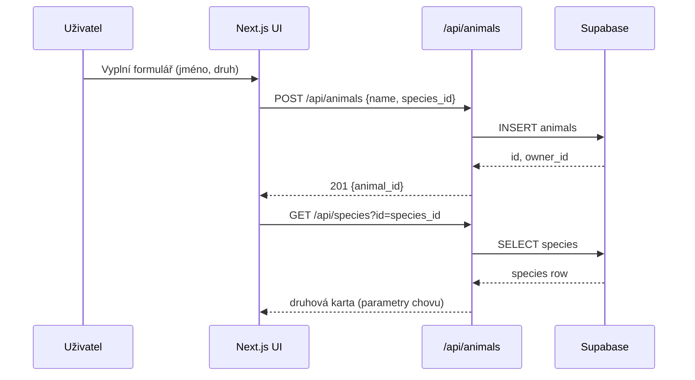
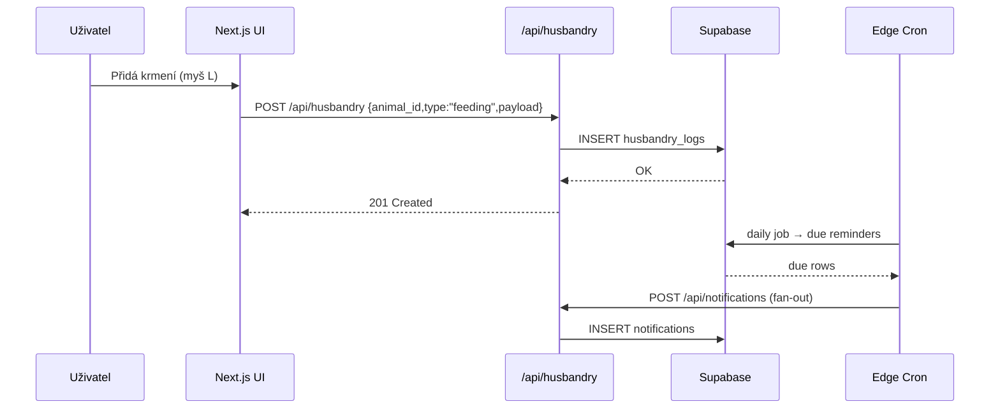
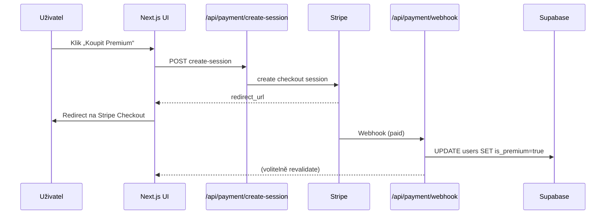

# 🦜 MŮJ EXOT — Digitální pas pro exotická zvířata

Modulární platforma pro chovatele, veterináře a kupující?.
**Cíle:** jednotná karta zvířete, zdravotní dokumentace, husbandry deník, reprodukce, genetika, QR nouzová karta, mapa vetů a (volitelně) placené konzultace.

---

## ⚡️ Klíčové funkce (MVP → Premium)

**MVP (v1.0–1.3)**

* **Zvířecí profil (Pass):** identita, fotky, druh, štítky, akutní stav, QR.
* **Druhová karta:** původ, biotop, ideální podmínky (teplota/vlhkost/UVB), dieta ve volné přírodě i v zajetí.
* **Husbandry deník:** krmení, svlékání, vážení, UVB výměny, připomínky, hromadné akce, šablony péče.
* **Zdravotní záznamy:** diagnózy, laboratorní výsledky, **léčebné protokoly** (dávky, intervaly, upozornění).
* **Reprodukce:** páření, očekávané termíny, snůšky/porody, evidence mláďat, rodokmen.
* **Genetika:** mutace (dominantní/recesivní/sex-linked, het/visual), jednoduchá genetická kalkulačka.
* **Převod zvířat:** bezpečný transfer mezi účty + zachování historie.
* **Nouzová karta (QR):** veřejná stránka zvířete s kontaktem a pokyny.
* **Mapa vetů & SOS:** seznam specialistů na exoty, rychlý kontakt.

**Premium (v2.x)**

* **Inventář & sklad:** krmivo, UVB, substráty; automatická spotřeba z logů; prahy zásob.
* **Placení (Stripe/GoPay):** konzultace, předplatné, prémiové exporty.
* **Exporty:** PDF pas/rodokmen, CSV logy.
* **AI Alfonso (vrstva):** OCR zdravotních zpráv, kontrola dávek, doporučení péče, prediktivní upozornění.
* **PWA/Offline:** mobilní použití, push notifikace.

---

## 🧱 Architektura

```
Next.js (App Router, TS, Tailwind)
   └─ UI & Pages (/app, /components)
   └─ API Routes (/pages/api/*)  → serverless logika
        ├─ Supabase (PostgreSQL, Auth, Storage)
        ├─ Stripe/GoPay (volitelně)
        └─ OpenAI (Alfonso, volitelně)
```

* **DB (Supabase/PostgreSQL):**

  * `species` – druhy (origin, wild/captive diet, temp_min/max, humidity, uvb_need, enclosure_notes)
  * `animals` – zvířata (FK `species_id`, datum narození, pohlaví, štítky, akutní stav)
  * `medical_records`, `medications` (léčba s dávkami a intervaly)
  * `husbandry_logs` (krmení, svlek, UVB, vážení; hromadné operace)
  * `breedings` (pairing, data snůšky/porodu, outcome, rodiče)
  * `genetic_traits` (mutace/morfy)
  * `transfers` (QR převody)
  * **Premium:** `inventory`, `inventory_logs`
  * podpůrné: `care_templates`, `notes_tags`, `notifications`, `qr_links`

* **Storage (Supabase Buckets):** fotky zvířat, přílohy (RTG/PDF), QR.

---

## 📂 Struktura repozitáře

```
muj-exot/
├─ .env.example
├─ .gitignore
├─ README.md
├─ LICENSE
├─ package.json
├─ tsconfig.json
├─ next.config.js
├─ postcss.config.js
├─ tailwind.config.js
│
├─ public/
│   ├─ favicon.ico
│   ├─ logo.svg
│   ├─ qr-placeholder.png
│   └─ emergency-card-template.png
│
├─ app/
│   ├─ layout.tsx
│   ├─ page.tsx                  # dashboard
│   ├─ animals/
│   │   ├─ page.tsx              # list
│   │   ├─ new/page.tsx          # create
│   │   └─ [id]/page.tsx         # detail (Pass)
│   ├─ husbandry/page.tsx
│   ├─ breeding/page.tsx
│   ├─ emergency/[id]/page.tsx
│   ├─ vets/page.tsx             # mapa vetů
│   ├─ transfer/page.tsx
│   └─ settings/page.tsx
│
├─ pages/
│   └─ api/
│       ├─ animals.ts
│       ├─ species.ts
│       ├─ husbandry.ts
│       ├─ breedings.ts
│       ├─ genetics.ts
│       ├─ transfers.ts
│       ├─ medications.ts
│       ├─ notifications.ts
│       ├─ ocr.ts                # Alfonso OCR (volitelně)
│       └─ payment/
│           ├─ create-session.ts # Stripe/GoPay
│           └─ webhook.ts
│
├─ components/
│   ├─ Header.tsx
│   ├─ Sidebar.tsx
│   ├─ AnimalCard.tsx
│   ├─ SpeciesInfo.tsx
│   ├─ HusbandryForm.tsx
│   ├─ BreedingPanel.tsx
│   ├─ GeneticsForm.tsx
│   ├─ MedicationSchedule.tsx
│   ├─ QRCodeCard.tsx
│   └─ Tabs.tsx
│
├─ supabase/
│   ├─ schema.sql
│   ├─ species_seed.sql
│   └─ supabaseClient.ts
│
├─ utils/
│   ├─ date.ts
│   ├─ genetics.ts
│   ├─ validations.ts
│   └─ qr.ts
│
└─ docs/
    ├─ architecture.md
    ├─ api-routes.md
    ├─ db-schema.md
    ├─ roadmap.md
    └─ style-guide.md
```

---

## ▶️ Rychlý start

```bash
# 1) Klon a instalace
git clone <repo>
cd muj-exot
npm install

# 2) Env
cp .env.example .env.local
# doplň SUPABASE_URL, SUPABASE_ANON_KEY
# (volitelně) OPENAI_API_KEY, STRIPE_SECRET_KEY

# 3) DB
# nahraj supabase/schema.sql a species_seed.sql
# do Supabase (SQL editor)

# 4) Dev server
npm run dev
```

---

## 🔐 Bezpečnost & práva

* **Supabase Auth** – každý uživatel vidí a upravuje **jen svá** zvířata (RLS policies).
* **Veřejné QR** – pouze read-only data (bez citlivých údajů).
* **Secrets** – klíče jen v serverových routách (`/pages/api/*`), ne na klientu.
* **PII/GDPR** – export/mazání účtu na požádání; logování přístupů k záznamům.

---

## ✅ Kvalita & standardy

* **TypeScript** povinně (strict).
* **ESLint + Prettier** v CI.
* **Atomic design** komponent, **kolokační styl** (Tailwind).
* **Testy:** Vitest/Jest (unit), Playwright (E2E na klíčové toky).
* **Accessibility (a11y):** role/aria, kontrast, klávesová navigace.
* **i18n:** připravené textové klíče (CZ/EN).

---

## 🧪 Testování (doporučení)

* **Unit:** utils (genetika, kalkulace termínů, validace dávek).
* **API kontrakty:** Zod/Valibot validace payloadů.
* **E2E scénáře:**

  1. založení zvířete → zobrazení druhové karty
  2. přidání husbandry logu + připomínky
  3. přidání léčby + kontrola intervalu
  4. páření → snůška → založení mláděte
  5. generace QR → veřejná nouzová karta
  6. transfer zvířete mezi účty

---

## 📈 Observabilita & provoz

* **Logy:** Vercel + Supabase logs.
* **Monitoring:** základní health-check route `/api/health`.
* **Zálohy:** Supabase point-in-time recovery; export SQL týdně.
* **Migrace DB:** verze v `supabase/migrations`; nikdy ručně v produkci.
* **SLA:** cílit 99.5 % uptime (Vercel+Supabase standard).

---

## 💳 Monetizace (volitelné)

* **Stripe/GoPay**: předplatné, jednorázové konzultace, prémiové exporty.
* **Roles:** `is_premium` v `users`, gate v UI i API.
* **Webhooks:** `/pages/api/payment/webhook.ts` → aktivace prémií.

---

## 🔌 Integrace

| Projekt         | Popis integrace                         |
| --------------- | --------------------------------------- |
| VetExotic.eu    | sdílení zdravotních dokumentů (budoucí) |
| RegistrPtaku.cz | identifikace papoušků (budoucí)         |
| Alfonso AI      | OCR + doporučení dávkování (volitelně)  |
| ExoMix          | výživové doporučení (budoucí)           |

---

## 🛣️ Roadmapa verzí

**v1.0 – Core Pass**
Zvířata, druhová karta, husbandry, QR nouzová karta, připomínky.

**v1.1 – Reprodukce & Genetika**
Páření, porodní kalkulačka, mláďata, základní genetický engine.

**v1.2 – Zdraví & Léčba**
Diagnózy, laboratorní výsledky, léčebné protokoly, export pro vet.

**v1.3 – Transfer & Vet mapa & SOS**
Převody zvířat, historie majitelů, mapa vetů, SOS kontakt.

**v2.0 – Premium**
Inventář, exporty PDF/CSV, platby, AI Alfonso, PWA/Offline.

---

## 🤝 Jak přispět

1. Vytvoř issue / feature request.
2. Fork → feature branch → PR proti `dev`.
3. PR musí projít: build, lint, testy, a11y lint.

---

## 📜 Licence

**MIT** (open-source základ).
Databázové seed výstupy a prémiový obsah mohou být licencovány odděleně VetExotic Group s.r.o.

---

## 👤 Kontakt

**MVDr. Hector Sebastian Franco, GPCert ExAP**
VetExotic Group
E-mail: info@vetexotic.eu  
Web: www.vetexoticgroup.cz

---

### ✅ Check-list před produkcí

* [ ] RLS policy pro všechny tabulky s osobními daty
* [ ] Error boundary + fallback stránky (404/500)
* [ ] Validace payloadů (Zod) na všech API routách
* [ ] Minimálně 10 E2E testů klíčových toků
* [ ] Cron/edge job pro připomínky
* [ ] Logování a alerting (Vercel/Supabase)
* [ ] DPIA/GDPR poznámky v `docs/`

---


---

# 1) Architektura systému (high-level)

```mermaid
flowchart LR
  subgraph Client[Frontend • Next.js + Tailwind + TS]
    UI[UI Komponenty\n(app/, components/)]
    PWA[Notifikace/Offline (v2)]
  end

  subgraph API[Serverless API • pages/api/*]
    ANIMALS[/animals.ts/]
    SPECIES[/species.ts/]
    HUSBANDRY[/husbandry.ts/]
    BREEDINGS[/breedings.ts/]
    GENETICS[/genetics.ts/]
    MEDS[/medications.ts/]
    TRANSFERS[/transfers.ts/]
    NOTIFS[/notifications.ts/]
    PAY_CREATE[/payment/create-session.ts/]
    PAY_WH[/payment/webhook.ts/]
    OCR[/ocr.ts (AI Alfonso)/]
  end

  subgraph DB[Supabase • PostgreSQL + Auth + Storage]
    DBT[(Tables)]
    RLS[Row Level Security]
    STORAGE[(Buckets: photos,\nattachments, qr)]
  end

  subgraph Ext[Externí služby]
    STRIPE[Stripe/GoPay\n(předplatné/platby)]
    OPENAI[OpenAI\n(Alfonso OCR/poradce)]
    MAPS[Map provider\n(Google/Leaflet)]
  end

  UI -->|fetch| API
  API -->|SQL| DBT
  API --> RLS
  API --> STORAGE
  API -->|webhook/checkout| STRIPE
  API -->|chat/ocr| OPENAI
  UI --> MAPS
  PWA -. push .- NOTIFS
```

---

# 2) ER diagram (datový model • Supabase)

```mermaid
erDiagram
  users {
    uuid id PK
    text email
    boolean is_premium
    timestamptz created_at
  }

  species {
    int id PK
    text common_name
    text latin_name
    text origin
    text wild_diet
    text captive_diet
    numeric temp_min
    numeric temp_max
    numeric humidity
    boolean uvb_need
    text enclosure_notes
  }

  animals {
    int id PK
    uuid owner_id FK
    int species_id FK
    text name
    text sex
    date birth_date
    boolean acute_status
    text notes
    timestamptz created_at
  }

  medical_records {
    int id PK
    int animal_id FK
    text diagnosis
    text lab_results
    timestamptz visit_date
    text attachments_url
  }

  medications {
    int id PK
    int animal_id FK
    text drug_name
    text dosage        // mg/kg nebo plain text
    text interval      // např. q12h
    date start_date
    date end_date
    text notes
  }

  husbandry_logs {
    int id PK
    int animal_id FK
    text type          // feeding|shed|weight|uvb|cleaning
    jsonb payload      // {food:"mouse L", weight: 320, uvb:"T5 12%"}
    timestamptz at
    int batch_id
  }

  breedings {
    int id PK
    int male_id FK
    int female_id FK
    date paired_on
    date expected_clutch
    text outcome       // eggs/live/slugs/none
    text notes
  }

  genetic_traits {
    int id PK
    int animal_id FK
    text trait         // hypo|albino|cosmic...
    text type          // dom|rec|sex-linked|het|visual
    text source        // test|pedigree|owner
  }

  transfers {
    int id PK
    int animal_id FK
    uuid from_user FK
    uuid to_user FK
    text status        // pending|accepted|rejected
    text qr_token
    timestamptz created_at
  }

  notifications {
    int id PK
    uuid user_id FK
    text kind          // reminder|low-stock|med
    text message
    timestamptz due_at
    boolean sent
  }

  inventory {
    int id PK
    uuid owner_id FK
    text item_name
    numeric quantity
    text unit          // pcs|g|kg|ml|l
    numeric threshold
    text notes
  }

  inventory_logs {
    int id PK
    int inventory_id FK
    numeric change     // +5, -1
    text reason        // feeding|purchase|waste
    timestamptz at
  }

  care_templates {
    int id PK
    uuid owner_id FK
    text name
    jsonb schedule     // {feeding:"7d", weight:"30d", uvb:"180d"}
  }

  users ||--o{ animals : owns
  species ||--o{ animals : classifies
  animals ||--o{ medical_records : has
  animals ||--o{ medications : has
  animals ||--o{ husbandry_logs : has
  animals ||--o{ genetic_traits : has
  users ||--o{ notifications : receives
  users ||--o{ inventory : owns
  inventory ||--o{ inventory_logs : logs
  animals ||--o{ transfers : transferred
  users ||--o{ care_templates : defines
  animals ||--o{ breedings : (male/female)
```

---

# 3) Sekvenční diagramy hlavních toků

### 3.1 Přidání zvířete + druhová karta



### 3.2 Husbandry log + připomínka



### 3.3 Platba (Stripe) za konzultaci/premium



---

# 4) Minimální SQL (výřez) pro start

```sql
-- species
create table if not exists species (
  id serial primary key,
  common_name text,
  latin_name text,
  origin text,
  wild_diet text,
  captive_diet text,
  temp_min numeric,
  temp_max numeric,
  humidity numeric,
  uvb_need boolean default false,
  enclosure_notes text
);

-- animals
create table if not exists animals (
  id serial primary key,
  owner_id uuid references auth.users(id) on delete cascade,
  species_id int references species(id),
  name text not null,
  sex text,
  birth_date date,
  acute_status boolean default false,
  notes text,
  created_at timestamptz default now()
);

-- husbandry_logs (typově volné přes payload)
create table if not exists husbandry_logs (
  id serial primary key,
  animal_id int references animals(id) on delete cascade,
  type text check (type in ('feeding','shed','weight','uvb','cleaning')),
  payload jsonb not null,
  at timestamptz default now(),
  batch_id int
);

-- jednoduché RLS příklady
alter table animals enable row level security;
create policy "owner_can_select_animals"
  on animals for select
  using (owner_id = auth.uid());
create policy "owner_can_modify_animals"
  on animals for all
  using (owner_id = auth.uid());
```

---

# 5) Moduly & hranice odpovědnosti

* **Pass (profil zvířete)** – vlastní jen UI + CRUD; žádná byznys logika mimo API.
* **Husbandry** – logy jsou append-only; hromadné operace přes batch_id.
* **Zdraví/Léky** – validace dávkování na API; AI (Alfonso) jen doporučuje.
* **Reprodukce/Genetika** – kalkulace v `utils/genetics.ts`, čisté funkce + testy.
* **Transfer** – stavový automat (`pending/accepted/rejected`) + QR token.
* **Platby** – pouze přes server (webhook), nikdy na klientu.

---


